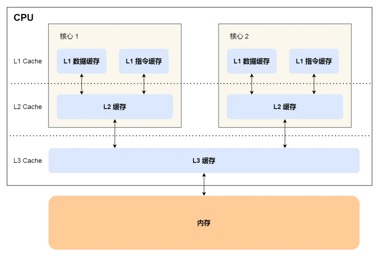

CPU的位数指的是CPU的位宽，表示一次最多能计算的范围
如果是 8 位的 CPU，那么一次只能计算 1 个字节 0~255 范围内的数值，这样就无法一次完成计算 10000 * 500 ，于是为了能一次计算大数的运算，CPU 需要支持多个 byte 一起计算，所以 CPU 位宽越大，可以计算的数值就越大，比如说 32 位 CPU 能计算的最大整数是 4294967295。

常见的寄存器种类：
通用寄存器，用来存放需要进行运算的数据，比如需要进行加和运算的两个数据。
程序计数器，用来存储 CPU 要执行下一条指令「所在的内存地址」，注意不是存储了下一条要执行的指令，此时指令还在内存中，程序计数器只是存储了下一条指令「的地址」。
指令寄存器，用来存放当前正在执行的指令，也就是指令本身，指令被执行完成之前，指令都存储在这里。

总线
总线是用于 CPU 和内存以及其他设备之间的通信，总线可分为 3 种：

地址总线，用于指定 CPU 将要操作的内存地址；
数据总线，用于读写内存的数据；
控制总线，用于发送和接收信号，比如中断、设备复位等信号，CPU 收到信号后自然进行响应，这时也需要控制总线；
当 CPU 要读写内存数据的时候，一般需要通过下面这三个总线：

首先要通过「地址总线」来指定内存的地址；
然后通过「控制总线」控制是读或写命令；
最后通过「数据总线」来传输数据；

线路位宽：线路位宽决定了内存的最大值
CPU 想要操作「内存地址」就需要「地址总线」：

如果地址总线只有 1 条，那每次只能表示 「0 或 1」这两种地址，所以 CPU 能操作的内存地址最大数量为 2（2^1）个（注意，不要理解成同时能操作 2 个内存地址）；
如果地址总线有 2 条，那么能表示 00、01、10、11 这四种地址，所以 CPU 能操作的内存地址最大数量为 4（2^2）个。
那么，想要 CPU 操作 4G 大的内存，那么就需要 32 条地址总线，因为 2 ^ 32 = 4G

CPU 的位宽最好不要小于线路位宽，比如 32 位 CPU 控制 40 位宽的地址总线和数据总线的话，工作起来就会非常复杂且麻烦，所以 32 位的 CPU 最好和 32 位宽的线路搭配，因为 32 位 CPU 一次最多只能操作 32 位宽的地址总线和数据总线。

如果用 32 位 CPU 去加和两个 64 位大小的数字，就需要把这 2 个 64 位的数字分成 2 个低位 32 位数字和 2 个高位 32 位数字来计算，先加个两个低位的 32 位数字，算出进位，然后加和两个高位的 32 位数字，最后再加上进位，就能算出结果了，可以发现 32 位 CPU 并不能一次性计算出加和两个 64 位数字的结果。

对于 64 位 CPU 就可以一次性算出加和两个 64 位数字的结果，因为 64 位 CPU 可以一次读入 64 位的数字，并且 64 位 CPU 内部的逻辑运算单元也支持 64 位数字的计算。

但是并不代表 64 位 CPU 性能比 32 位 CPU 高很多，很少应用需要算超过 32 位的数字，所以如果计算的数额不超过 32 位数字的情况下，32 位和 64 位 CPU 之间没什么区别的，只有当计算超过 32 位数字的情况下，64 位的优势才能体现出来。

另外，32 位 CPU 最大只能操作 4GB 内存，就算你装了 8 GB 内存条，也没用。而 64 位 CPU 寻址范围则很大，理论最大的寻址空间为 2^64。

Linux 内核设计的理念主要有这几个点：
MultiTask，多任务
SMP，对称多处理
ELF，可执行文件链接格式
Monolithic Kernel，宏内核

