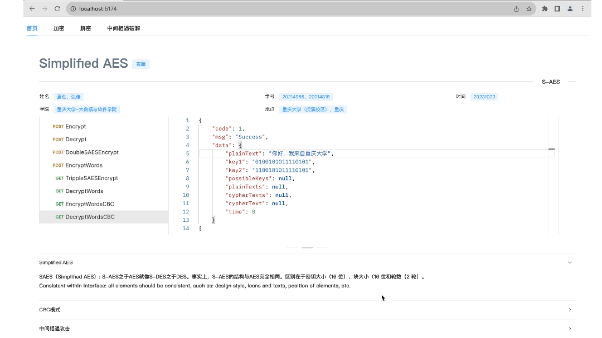
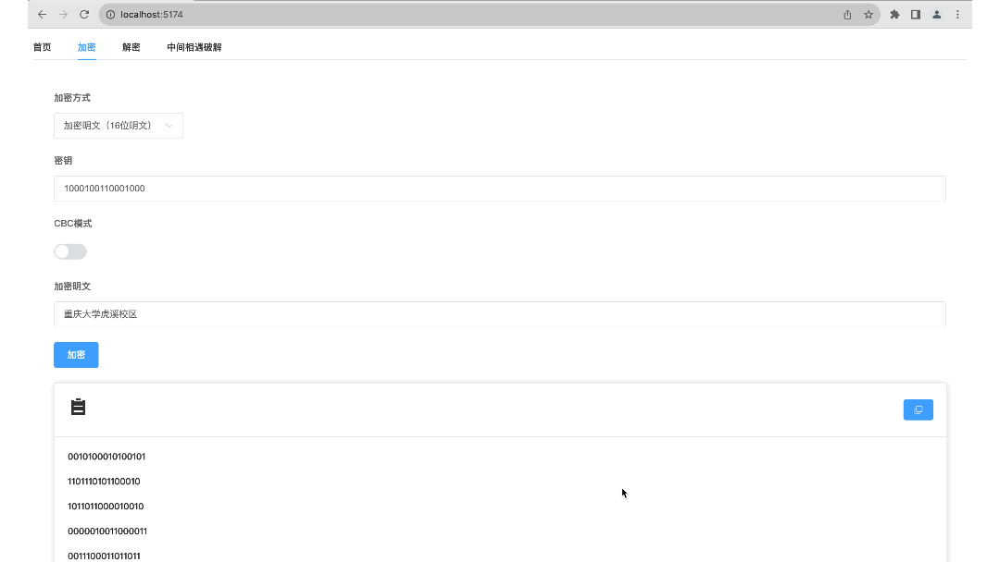
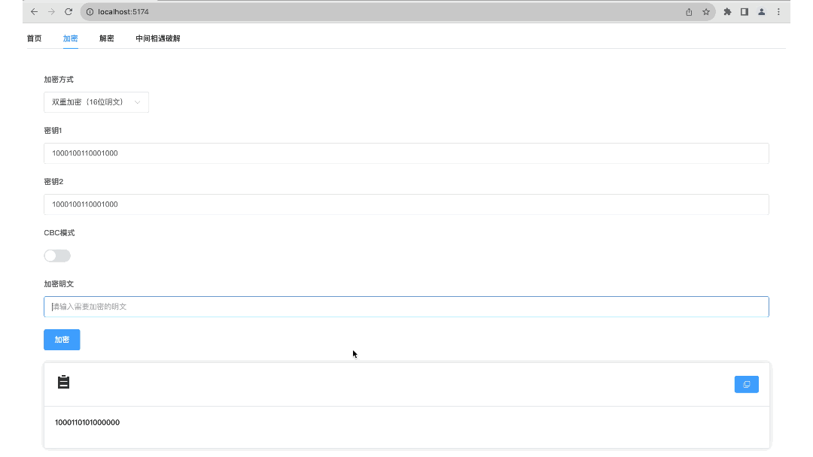
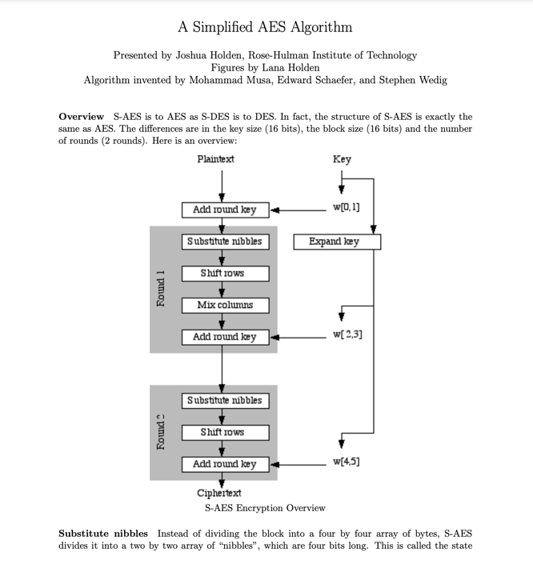
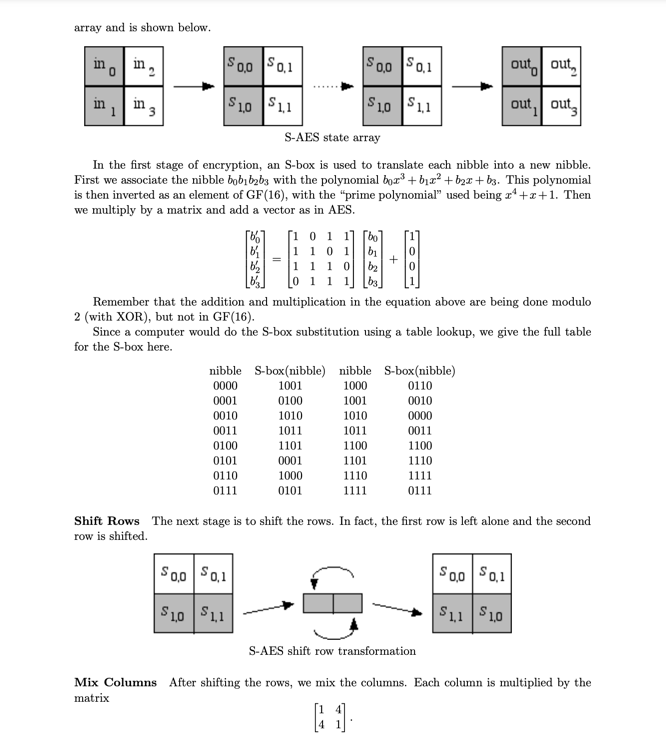
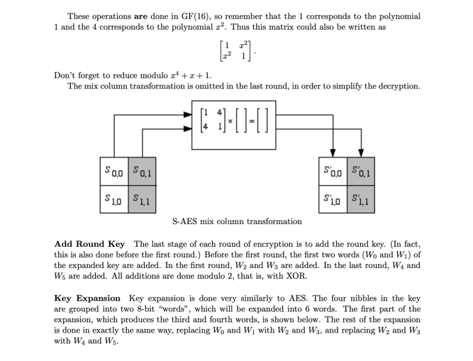
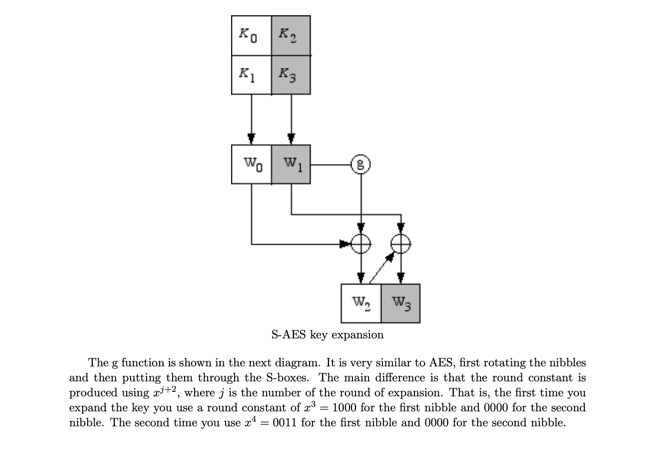
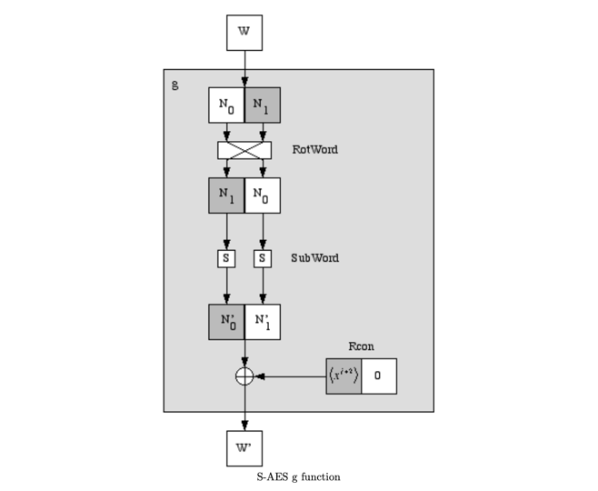

<!-- PROJECT LOGO -->
 

<h3 align="center">Lab: S-AES的复现</h4>

重庆大学大数据与软件学院

  

    信息安全导论SAES（Simplified AES Algorithm）加密算法复现
     
    <a href="https://github.com/Jinlkj/SAES-BackEnd"><strong>去看看项目后端 »</strong></a>
     
     
    <a href="https://jinlkj.github.io/SAES-FrontEnd/">观看演示</a>
    ·
    <a href="https://github.com/Jinlkj/SAES-BackEnd/issues">报告bug</a>
    ·
    <a href="https://github.com/Jinlkj/SAES-BackEnd/issues">申请功能</a>
  

<!-- 目录 -->

  
目录

  <ol>
    <li><a href="#关于项目">关于项目</a></li>
    <li><a href="#项目框架">项目框架</a></li>
    <li><a href="#算法详解">算法详解</a></li>
    <li><a href="#运行该项目">运行该项目</a></li>
  </ol>

<!-- ABOUT THE PROJECT -->
## 关于项目

AES加密算法是一种对称加密算法，它使用相同的密钥进行加密和解密。它是一种块密码算法，将数据分成固定长度的块，每个块都使用相同的密钥进行加密。AES加密算法使用128位、192位或256位的密钥，具体取决于要加密的数据的安全级别。它是一种替换-置换网络，也称为SP网络。它由一系列链接操作组成，包括将输入替换为特定输出（替换）和涉及位移动（置换）的其他操作。

AES算法优势:
* 安全性高
* 加密速度快
* 硬件实现方便
* 可扩展性强

AES算法劣势：
* 算法复杂度高
* 密钥管理困难
* 密文长度固定

Simplified AES (SAES) 是一种教学用的加密算法，它是 AES 的简化版本。SAES 的设计目的是为了帮助学生更好地理解 AES 的工作原理。SAES 和 AES 的主要区别在于它们处理数据的方式和复杂性。

相比之下，SAES 使用更小的密钥和数据块大小，这使得加密过程更容易理解和实现。然而，这也意味着 SAES 在安全性上不如 AES。因此，虽然 SAES 对于教学和学习目的来说非常有用，但在需要高级安全性的实际应用中，我们通常会使用 AES 而不是 SAES。

### 项目演示
1.长文本加密解密

2.16位明文加密解密

3.双重加密，三重加密

4.明密文对解密

### 算法详解

[（原文链接）](https://www.rose-hulman.edu/class/ma/holden/Archived_Courses/Math479-0304/lectures/s-aes.pdf)
<!-- GETTING STARTED -->
